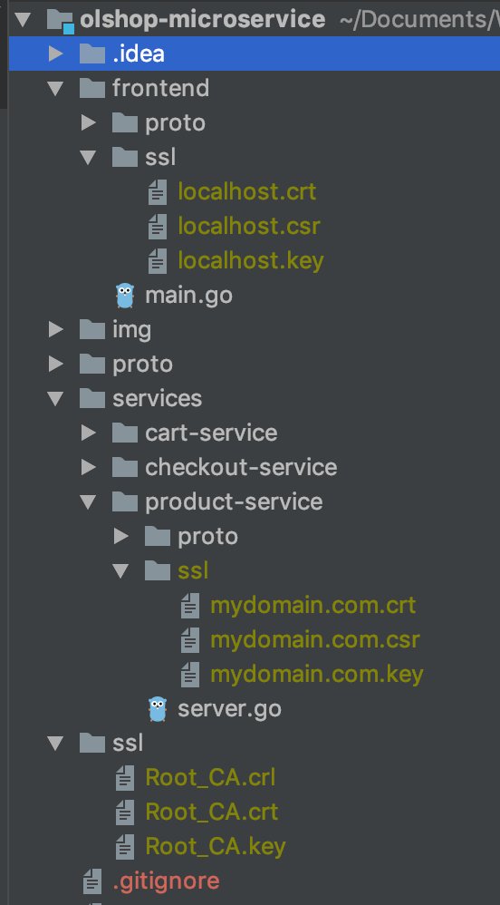

## Service Architecture
This sample app is composed of manu microservices written in different languages that talk to each other over gRPC.

[](./img/architecture-diagram.png)

**Services List**

| Service | Language | Description |
|---------|----------|-------------|
|[frontend](./frontend) | Go | Exposes an HTTP server |
|[productservice](./services/product-service) | Go | Provides the list of products |
|[cartservice](./services/cart-service) | Python | Stores the items in the user's shipping cart in Redis and retrieves it |
|[checkoutservice](./services/checkout-service) | Node.js | Retrieves user cart, prepares order and orchestrates the payment and shipping detail |
|[shippingservice](./services) | Java | (Not Ready Yet) |


## API Endpoint
| Endpoint | Method | Description |
|---------|----------|-------------|
| /product | GET | Get all product catalog |
| /product/:id | GET | Get product with specific id |
| /cart/:userId | POST | Add cart item for specific user (detail below) |
| /cart/:userId | GET | Get cart item |
| /checkout/:userId | GET | Checkout process |


**Add Cart Params** (form-data)


`name`  : Name of Product

`qty`   : Item quantity


## Installation
Follow the instructions for installation process for each programming languages  https://grpc.io/docs/quickstart/


## Run Program
To run the application, run all services
```$xslt
go run services/product-service/server.go
node services/checkout-service/server.js
python3 services/cart-service/server.py
go run frontend/main.go
```
This app is running on **port: 8080**

## Authentication
gRPC is supported authentication by default. And we will be using SSL/TLS authentication for the sake of simplicity.

#### 1. Single TSL
The most easiest way is using single tsl which will be using to all services. 
To learn using single tls, checkout to branch `auth/ssl`

**Creating SSL/TLS Certificates**
```$xslt
mkdir ssl && cd ssl
openssl req -newkey rsa:2048 -nodes -keyout server.key -x509 -days 365 -out server.crt
```

Then try to run the application again

#### 2. Mutual TLS
The second way is using mutual tls, this mean every service will have their own certificate, but all certificates 
generated  from single root CA.
To learn using Mutual TLS, checkout to branch `auth/mutual-tls`

[certstrap](https://github.com/square/certstrap) will be our way to generate certificates. 

Install certstrap
```$xslt
$ git clone https://github.com/square/certstrap
$ cd certstrap
$ ./build
``` 

Create a CA, server cert, and private key
```$xslt
$ bin/certstrap init --common-name "Root CA"
$ bin/certstrap request-cert --domain mydomain.com
$ bin/certstrap sign --CA "Root CA" mydomain.com
$ bin/certstrap request-cert --common-name localhost --ip 127.0.0.1 
$ bin/certstrap sign --CA "Root CA" 127.0.0.1
```

copy out/Root_CA.* to ssl directory in our project

copy out/localhost.* to directory : frontend/ssl

copy out/mydomain.* to directory : services/product-service/ssl

the project structure should look like this :

[](img/mutual-tls_project_structure.png)


## Protobuf Generator

Generate for Go
```$xslt
protoc -I proto/ proto/product-service.proto --go_out=plugins=grpc:services/product-service/proto/
```


Generate for Python
```$xslt
cd services/cart-service
python3 -m grpc_tools.protoc -I../../proto --python_out=. --grpc_python_out=. ../../proto/cart-service.proto
```